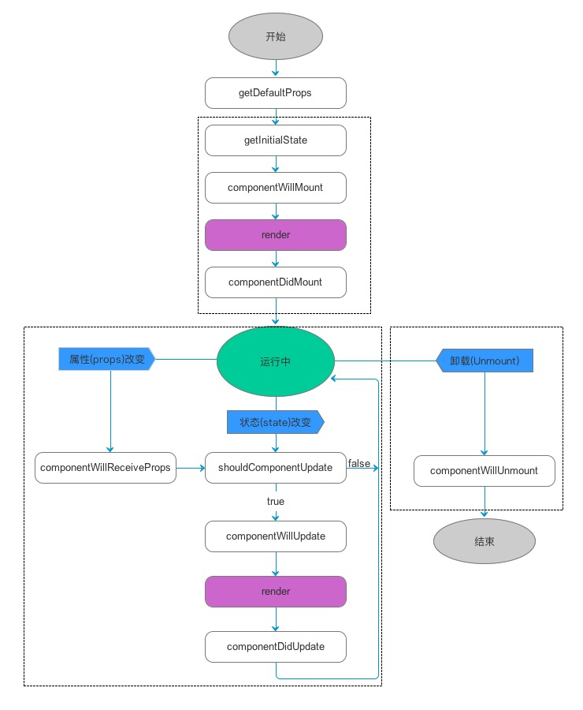

# 图片从模糊到清晰
在非列表的位置（因为列表就都加载一张默认图就好了，省流量啊，而且一般列表的图片不会很大）碰到比较大的图片，都是给张小一些默认图来解决，虽然能解决空位问题，但是他不好看啊。。  
那你看看下面的效果好不好看呢？
<!--  -->
<iframe src="https://jdvideo.300hu.com/vodtransgzp1251412368/7447398156424841325/v.f30.mp4"></iframe>
<video id="video" controls="true" preload="none" width="375" height="500">
    <source id="mp4" src="https://jdvideo.300hu.com/vodtransgzp1251412368/7447398156424841325/v.f30.mp4" type="video/mp4">
</video>

# 京东放大镜